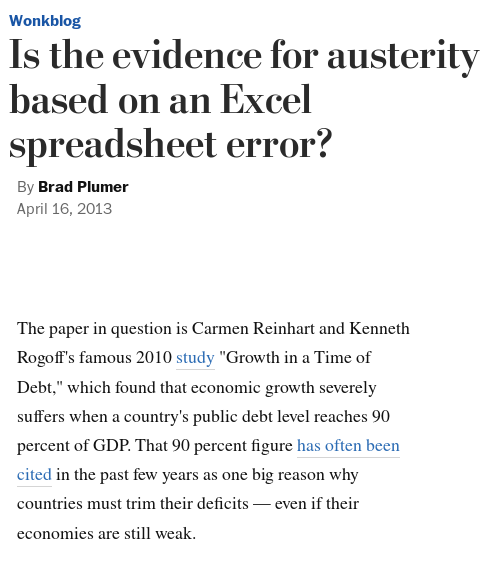
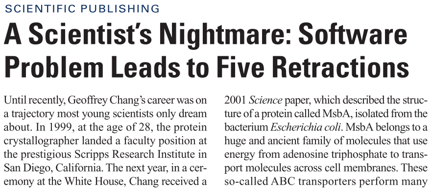

@title[Data Processing is Important]

@snap[north span-80]
Modelling or Data Processing It's all Important
@snapend

* Software Engineering is not just for projects with 1000's of lines of code
* Not just the fiddly thing you put off doing at the end
* What happens when it goes wrong - retractions :(

---

@snap[midpoint span-35]
When it all goes wrong
@snapend

@snap[west span-35]

@snapend

@snap[east span-35]

@snapend

@snap[south span-30]

@snapend

---

@title[Scripts>Spreadsheets]

* OK (just) for simple 2D data, rubbish for everything else, poor interoperability
* Coding gives you control + access to enormous quantity of libraries/prior work
* Ability to write modular pieces that can be combined into workflows.
